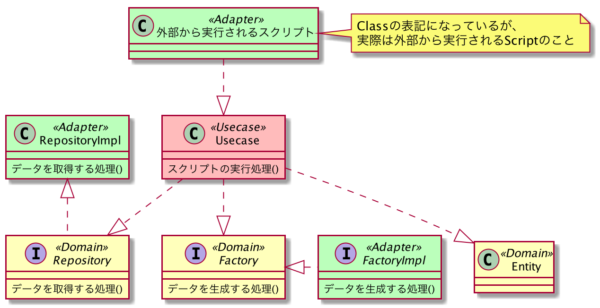

# 設問1
delyサーバーサイド技術選考課題の設問1の回答です。

## 目次
- [基本設計](#基本設計)
- [実行環境](#実行環境)
- [実行方法](#実行方法)

## 基本設計
クリーンアーキテクチャの設計思想に則っている。  
依存関係は外側から内側の方向のみとする。  

Adapterがもっとも外側にあり、外部から又は外部へのアクセスを行う。  
Usecaseはアプリケーションロジックである。  
Domainはビジネスロジックである。

## 実行環境
### 言語
Ruby 2.7.0

## 実行方法

1. Rubyの2.7.0をインストールする
2. /dely-test/question1に移動する
3. `ruby script/adapter/dely_script -f calculate_calorie`を実行する

